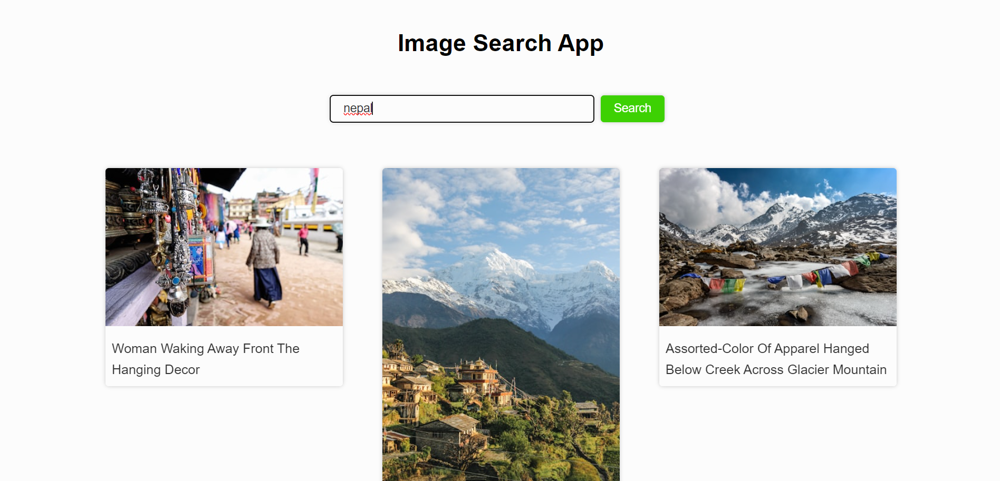

# Image Search App

<h2 align="center">Hi 👋, I'm Rahul Rajbhandari</h2>

This website lets you find any image you need, using  the Unsplash's API.
It's also fully responsive , so  it works smoothly on any device.

## Screenshots

## Visit the website :
[@imagekhoj](https://imagekhoj.netlify.app)

## Languages Used:

